# 1. 数据结构和算法

数据结构+算法=程序

## 1. 数据结构概述

### 1.1 概念

数据元素之间的关系

### 1.2 分类

#### 1.2.1 逻辑结构

​	数据元素之间的关系[★★★★★]

1. 集合结构:数据元素除了同属于一个集合外,没有任何关系

   

2. 线性结构:数据元素之间存在一对一的关系

   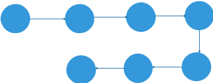

3. 树形结构:数据元素之间存在一对多的层次关系

   

4. 图形结构:数据元素之间存在多对多的关系

   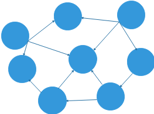

#### 1.2.1 物理结构

数据的逻辑结构在计算机上存储形式,包括内存,硬盘,软盘,光盘等

1. 顺序存储:数据元素存储在地址连续的存储单元里,其数据间的物理关系和逻辑关系是一致的.例如:【数组】的存储

   

2. 链式存储:数据结构存储在任意的存储单元里,这组存储单元可以连续,也可以不连续,数据单元中还存放着指针,指向其关联元素的位置.由于数据之前的关系经常发生变化,所以链式结构这种存储结构更加灵活.

   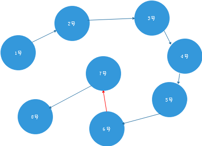

## 2 算法概述

### 2.1 概念

解决特定程序问题的技巧和方式.

针对某个特定问题,解决的算法不唯一,但是掌握一些好的算法很有帮助

### 2.2 特征

* 输入

  算法具有零个或多个输入

* 输出

  算法至少有一个或多个输出

* 有穷

  算法在执行完有限的步骤后自动结束而不会出现无限循环

* 确定性

  算法的每一个步骤都具有确定的含义,不会出现二义性

* 可行性

  算法的每一步都能必须是可行的,每一步执行有限次数完成

### 2.3 要求

* 正确性
* 可读性
* 健壮性
* 时间效率高存储量低

### 2.4 算法的效率

* 事后统计法

  不可取,因为要编写独立的测试方法,麻烦

  不同的测试方法和环境也会导致统计结果的差异

* **事前统计法**

  研究算法随着输入规模的增大其增长量的抽象!

  进行输入测试时,关注主要项,忽略次要项!

### 2.4 算法的时间复杂度

* 概念

​	研究规模n的增大,算法执行次数的**增长率**.
​	执行次数==时间

* 表示法

  大O表示法

* 大O表示法的推算攻略

  1. 用常数1取代加法常数
  2. 只保留最高阶项
  3. 如果最高阶存在且不为1,去掉这个项相乘的常数

* 举例

  算法复杂度:O(1)

---


​	算法复杂度:O(n)

------


​	算法复杂度:O(n²)

---

* 常见时间复杂度举例

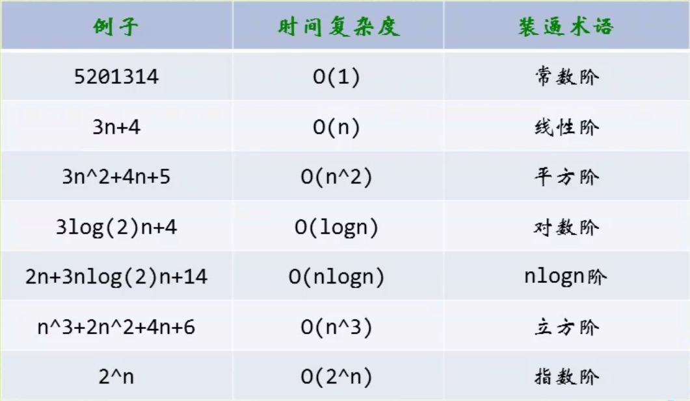

效率

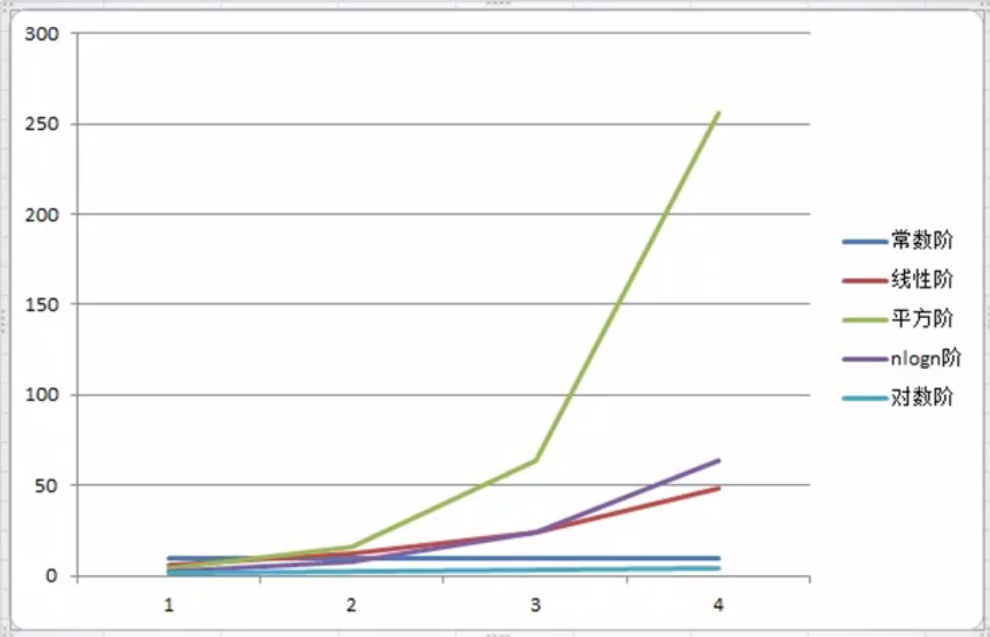

## 3. 线性结构

### 3.1 顺序存储

元素按照逻辑上的先后关系依次存储

* 优点
  1. 无须为额外的逻辑关系而增加额外的存储空间.(物理结构和逻辑结构一致)
  2. 可以快速的存取表中任意位置的元素.(通过下标快速找到指定元素)
* 缺点
  1. 插入和删除元素需要移动大量元素.(需要对其他元素重新定义下标)
  2. 当线性表长度变化较大时,难以确定存储空间的容量.(每次分配连续的空间存储数据)
  3. 容易造成存储空间的碎片

### 3.2 链式存储

每个节点及存储数据也存储下个元素的地址(指针),第一个节点称作头节点,第二个节点称为尾节点.

创建方式有头插法(插入顺序和输入顺序想法)和尾插法(插入顺序和插入顺序一致)

* 优点

  无须预先分配空间,空间可以不连续

  有效的利用存储空间,较少空间碎片化

* 缺点

  元素没有下标,需要循环查找

### 3.3 对比总结

* 分配方式

  * 顺序结构需要一段连续的存储单元依次存储线性表的数据
  * 链式结构用一组任意的存储单元存放线性表关系

* 时间性能

  - 查找
    - 顺序存储O(1)
    - 链式存储O(n)
  - 插入和删除
    - 顺序存储O(n)
    - 链式存储O(1)

* 空间性能

  * 顺序存储结构需要预分配存储空间,元素个数有限制
  * 单链表不需要预分配空间,元素个数无限制

* 总结

  频繁查找用顺序存储结构

  频繁插入和删除用链表存储结构

### 3.4 面试题(腾讯)

Q: 快速查找未知长度单链表的中间节点

回答一:时间复杂度O(n+n/2)=O(3n/2)

 	1. 先遍历链表确定总长度L
 	2. 再从头节点遍历到L/2

回答二:时间复杂度O(n)

 	1. 设置快慢2个指针,快指针的速度是慢指针的2倍
 	2. 快指针和慢指针同时遍历链表
 	3. 当快指针指向尾节点的时候慢指针刚好指向中间节点

### 3.5 常见链表


### 3.5 循环链表

### 3.5.1 约瑟夫问题

```java
public static void main(String[] args) {
    System.out.println("程序说明如下：");
    System.out.println("由m个人围成一个首尾相连的圈报数。从第一个人开始，从1开始报数，报到n的人出圈，剩下的人继续从1开始报数，直到所有的人都出圈为止。对于给定的m和n，求出所有人的出圈顺序.");
    //提示输入总人数
    System.out.println("请输入做这个游戏的总人数：");
    Scanner sca = new Scanner(System.in);
    int m = sca.nextInt();
    //提示输入要出圈的数值
    System.out.println("请输入要出圈的数值：");
    int n = sca.nextInt();
    System.out.println("按出圈的次序输出序号：");
    //创建有m个值的数组
    int[] a = new int[m];
    //初始长度，以后出圈一个，长度就减一
    int len = m;
    //给数组赋值
    for (int i = 0; i < a.length; i++)
        a[i] = i + 1;
    //i为元素下表，j代表当前要报的数
    int i = 0;
    int j = 1;
    while (len > 0) {  //如果数组长度减为0,结束游戏
        if (j % n == 0) {//找到要出圈的人，并把圈中人数减一
            System.out.print(a[i % m] + "  ");
            a[i % m] = -1;
            j = 1;//有人出圈后开始从1接着报数
            i++;
            len--;
        } else {//没人出圈，i++,位置往后移动，j++口号加一个，如刚才报的是1，下一个该报2,3,4直到n
            i++;
            j++;

        }
    }
    System.out.println();
    System.out.println("经过了"+i+"次,游戏结束");
}
```

# 2. 数组

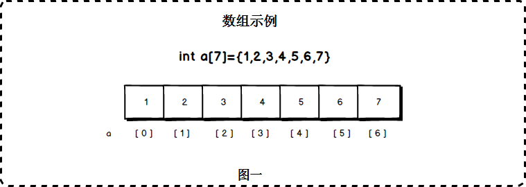

## 2.1 初始化

* 初始化给定长度数组,数组元素为默认值0

```java
int[] arr = new int[10];
```

* 初始化数组时赋值

```java
int[] arr = new int[]{1,2,4,3,4,5};
```

## 2.2 基本操作

### 2.2.1 自定义数组

```java
public class MyArray {
    private long[] arr;
    private int elements;   //元素个数

    public MyArray() {
        arr = new long[50];
    }
    
    public MyArray(int len) {
        arr = new long[len];
    }
}
```

### 2.2.2 添加元素

* 末尾追加

```java
public void insert(long value) {
    arr[elements] = value;
    elements++;
}
```

* 有序追加

```java
public void insert(long value) {
    int i;
    for (i = 0; i < elements; i++) {
        if (arr[i] > value) {
            break;
        }
    }
	
    //元素后移
    for (int j = elements; j>i ; j--) {
        arr[j]=arr[j-1];
    }
    arr[i]=value;
    elements++;
}
```


### 2.2.3 检查index是否合法

```java
private void checkIndex(int index) {
    if (index < 0 || index > elements - 1) {
        throw new ArrayIndexOutOfBoundsException();
    }
}
```

### 2.2.4 查找元素

```java
public long get(int index) {
    checkIndex(index);
    return arr[index];
}
```

### 2.2.5 搜索元素

```java
public int search(long value) {
    int index = -1;
    for (int i = 0; i < elements; i++) {
        if (arr[i] == value) {
            index = i;
            break;
        }
    }
    return index;
}
```

### 2.2.6 二分查找

```java
 public int binarySearch(long value) {
     int middle = 0;    
     int begin = 0;
     int last = elements;
     
     int index = -1;

     while (true) {
         //计算中间索引
         middle = (begin + last) / 2;
         //如果中间值刚好等于value,则返回middle
         if (arr[middle] == value) {
             index = middle;
             return index;
         } else if (begin > last) {  //退出条件
             break;
         } else {	//如果中间值大于value,重新查找前半段
             if (arr[middle] > value) {
                 last = middle - 1;
             } else {  //如果中间值小于value,重新查找前半段
                 begin = middle + 1;
             }
         }
     }
     return index;
 }
```

> 注意二分查找的元素必须有序

### 2.2.7 遍历元素

```java
public void display() {
    System.out.print("[ ");
    for (int i = 0; i < elements; i++) {
        System.out.print(arr[i] + " ");
    }
    System.out.print("]");
}
```

### 2.2.8 更新元素

```java
public void update(int index, long value) {
    checkIndex(index);
    arr[index] = value;
}
```

### 2.2.9 删除index的值

```java
 public void delelteByIndex(int index) {
     checkIndex(index);
     //从index开始遍历
     for (int j = index; j < elements; j++) {
         //将index后的值往前移动
         arr[j] = arr[j + 1];
     }
     //arr的数据总数-1
     elements--;
 }
```

### 2.2.10 删除value

```java
public void deleteByValue(long value) {
    //获得value的索引
    int index = search(value);
    //删除index对应的值
    delelteByIndex(index);
}
```

## 2.3 排序

### 2.3.1 冒泡排序


```java
public void bubbleSort(long[] arr) {
    //控制比较次数
    for (int i = 0; i < arr.length - 1; i++) {
        //比较值大小
        for (int j = arr.length - 1; j > i; j--) {
            //如果j小于j-1,向前冒泡
            if (arr[j] < arr[j - 1]) {
                long temp = arr[j];
                arr[j] = arr[j - 1];
                arr[j - 1] = temp;
            }
        }
    }
}
```

### 2.3.2 选择排序


```java
public void selectionSort(long[] arr) {
    //k永远指向最小数
    int k = 0;
    //交换的变量
    long temp = 0;
    for (int i = 0; i < arr.length - 1; i++) {
        //从第一位开始比较
        k = i;
        for (int j = i + 1; j < arr.length; j++) {
            //如果k位置的值大于j的值,k指向j
            if (arr[j] < arr[k]) {
                k = j;
            }
            //经过循环k永远指向最小值
        }
        //交换k和i的值
        temp = arr[i];
        arr[i] = arr[k];
        arr[k] = temp;
    }
}
```

### 2.3.4 插入排序


```java
public void insertSort(long[] arr) {

    for (int i = 1; i < arr.length; i++) {
        long temp = arr[i];
        int j = i - 1;
        while (j >= 0 && arr[j] > temp) {
            arr[j + 1] = arr[j];
            j--;
        }
        arr[j + 1] = temp;
    }
}
```

### 2.3.5 希尔排序

相比插入排序,希尔排序在移动元素的次数更少


```java
public void shellSort(long[] arr) {
    //初始化一个间隔
    int h = 1;
    while (h < arr.length / 3) {
        h = h * 3 + 1;
    }
    while (h > 0) {
        long temp = 0;
        for (int i = h; i < arr.length; i++) {
            temp = arr[i];
            int j = i;
            while (j > h - 1 && arr[j - h] >= temp) {
                arr[j] = arr[j - h];
                j -= h;
            }
            arr[j] = temp;
        }
        h = (h - 1) / 3;
    }
}
```

### 2.3.6 快速排序


```java
/**
 * 划分数组
 */
public int partition(long[] arr, int left, int right, long point) {
    int leftPtr = left - 1;
    int rightPtr = right;

    while (true) {
        while (leftPtr < rightPtr && arr[++leftPtr] < point) ;
        while (rightPtr > leftPtr && arr[--rightPtr] > point) ;

        if (leftPtr >= rightPtr) {
            break;
        } else {
            long temp = arr[leftPtr];
            arr[leftPtr] = arr[rightPtr];
            arr[rightPtr] = temp;
        }
    }
    long temp = arr[leftPtr];
    arr[leftPtr] = arr[right];
    arr[right] = temp;
    return leftPtr;
}

 /**
  * 快速排序
  *
  * @param arr
  * @param left
  * @param right
  */
 public void quickSort(long[] arr, int left, int right) {
     if (right - left <= 0) {
         return;
     } else {
         //设置比较关键字
         long point = arr[right];
         //获得切入点,同时对数组进行划分
         int partition = partition(arr, left, right, point);
         //对左边的子数组进行快速排序
         quickSort(arr, left, partition - 1);
         //对右边的子数组进行快速排序
         quickSort(arr, partition + 1, right);
     }
 }
```


# 3. 栈


## 3.1 初始化

```java
public class MyStack {
    /**
     * 底层是数组实现
     */
    private long[] arr;
    /**
     * 指向栈顶的指针
     */
    private int top;

    public MyStack() {
        arr = new long[10];
        top = -1;
    }
    
   	public MyStack(int length) {
        arr = new long[length];
        top = -1;
    }
}
```

## 3.2 基本操作

### 3.2.1 插入元素

```java
public void push(long value) {
    arr[++top] = value;
}
```

### 3.2.2 移除元素

```java
public long pop() {
    return arr[top--];
}
```

### 3.2.3 查看元素

```java
public long peek() {
    return arr[top];
}
```

### 3.2.4 判断是否为空

```java
public boolean isEmpty(){
    return top==-1;
}
```

### 3.2.5 是否已满

```java
public boolean isFull(){
    return top==arr.length-1;
}
```

# 4. 队列


## 4.1 初始化

```java
public class MyQueue {

    /**
     * 底层使用数组实现
     */
    private long[] arr;

    /**
     * 元素数量
     */
    private int elements;

    /**
     * 队头
     */
    private int front;

    /**
     * 队尾
     */
    private int end;

    public MyQueue() {
        arr = new long[10];
        elements = 0;
        front = 0;
        end = -1;
    }

    public MyQueue(int maxSize) {
        arr = new long[maxSize];
        elements = 0;
        front = 0;
        end = -1;
    }
}
```

## 4.2 基本操作

### 4.2.1 添加元素

* 非循环添加

```java
public void insert(long value) {
    arr[++end] = value;
    elements++;
}
```

* 循环添加

```java
public void insert(long value) {
    if (end>=arr.length-1) {
        end=-1;
    }else{
        elements++;
    }
    arr[++end] = value;
}
```

### 4.2.2 移除元素

* 非循环移除

```java
public long remove() {
    elements--;
    return arr[front++];
}
```

* 循环移除

```java
public long remove() {
	long value = arr[front++];
	if(front == arr.length) {
		front = 0;
	}
	elements--;
	return value;
}
```

### 4.2.3 查看元素

```java
public long peek() {
    return arr[front];
}
```

### 4.2.4 判断是否为空

```java
public boolean isEmpty() {
    return elements == 0;
}
```

### 4.2.5 判断是否已满

```java
public boolean isFull() {
    return elements == arr.length;
}
```

# 5. 单链表

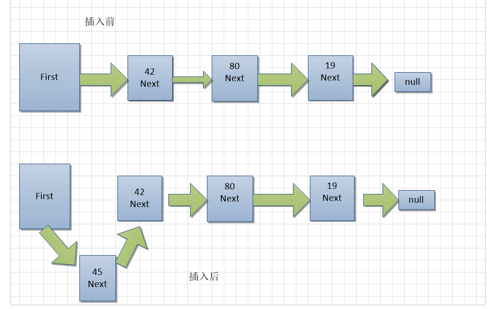

## 5.1 初始化

### 5.1.1 节点

```java
public class Node {
    public long value;
    public Node next;

    public Node(long value) {
        this.value = value;
    }

    public void display() {
        System.out.print(value+" ");
    }

}
```

### 5.1.2 链表对象

```java
public class LinkList {
    private Node first;

    public LinkList() {
        first = null;
    }
}
```

## 5.2 基本操作

### 5.2.1 插入头节点

```java
public void insertFirst(long value) {
    Node node = new Node(value);
    node.next = first;
    first = node;
}
```

### 5.2.2 删除头结点

```java
public Node deleteFirst() {
    Node tmp = first;
    first = tmp.next;
    return tmp;
}
```

### 5.2.3 遍历链表

```java
public void display() {
    Node current = first;
    while (current != null) {
        current.display();
        current = current.next;
    }
    System.out.println();
}
```

### 5.2.4 查找节点

```java
public Node find(long value) {
    Node current = first;
    if (current == null) {
        return null;
    }
    while (current.value != value) {
        if (current == null) {
            return null;
        }
        current = current.next;
    }
    return current;
}
```

### 5.2.5 删除节点

```java
public Node delete(long value) {
    Node current = first;
    Node previous = first;
    //找到值为value的节点
    while (current.value != value) {
        if (current.next == null) {
            return null;
        }
        previous = current;
        current = current.next;
    }
    
    if (current == first) {
        first = first.next;
    } else {
        previous.next = current.next;
    }
    return current;
}
```

# 6. 双端链表

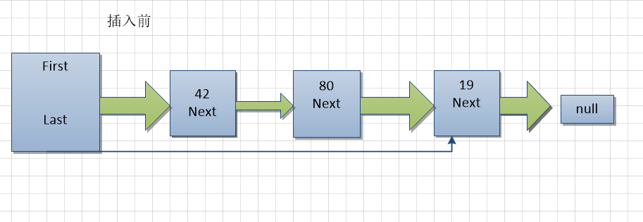

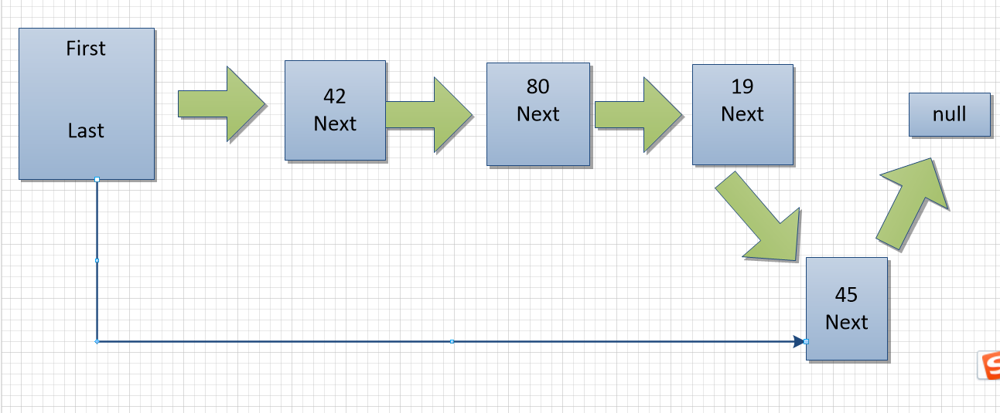

## 6.1 初始化

```java
public class FirstLastLinkList {
    /**
     * 头结点
     */
    private Node first;
    /**
     * 尾节点
     */
    private Node last;

    public FirstLastLinkList() {
        this.first = null;
        this.last = null;
    }
}
```

## 6.2 基本操作

### 6.2.1 插入头结点

```java
public void insertFirst(long value) {
    Node node = new Node(value);
    if (isEmpty()) {
        last = node;
    }
    node.next = first;
    first = node;
}
```

### 6.2.2 插入尾节点

```java
public void insertLast(long value) {
    Node node = new Node(value);
    if (isEmpty()) {
        first = node;
    } else {
        last.next = node;
    }
    last = node;
}
```

### 6.2.3 删除头节点

```java
public Node deleteFirst() {
    Node temp = first;
    if (first.next == null) {
        last = null;
    }
    first = temp.next;
    return temp;
}
```

### 6.2.4 遍历链表

```java
public void display() {
    Node current = first;
    while (current != null) {
        current.display();
        current = current.next;
    }
    System.out.println();
}
```

### 6.2.5 查找节点

```java
public Node find(long value) {
    Node current = first;
    while (current.value != value) {
        if (current.next == null) {
            return null;
        }
        current = current.next;
    }
    return current;
}
```

### 6.2.6 删除节点

```java
public Node delete(long value) {
    Node current = first;
    Node previous = first;
    while (current.value != value) {
        if (current.next == null) {
            return null;
        }
        previous = current;
        current = current.next;
    }

    if (current == first) {
        first = first.next;
    } else {
        previous.next = current.next;
    }

    return current;
}
```

### 6.2.7 判断链表是否为空

```java
public boolean isEmpty() {
    return first == null;
}
```

# 7. 双向链表

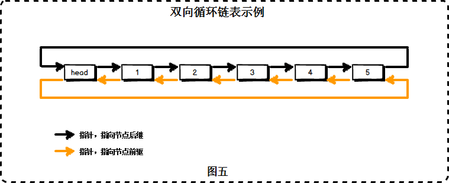

## 7.1 初始化

### 7.1.1 节点

```java
public class DoubleNode {

    public long value;

    public DoubleNode next;
    public DoubleNode previous;

    public DoubleNode(long value) {
        this.value = value;
    }

    public void display() {
        System.out.print(value + " ");
    }
}
```

### 7.1.2 链表对象 

```java
public class DoubleLinkList {

    /**
     * 头结点
     */
    private DoubleNode first;

    /**
     * 尾节点
     */
    private DoubleNode last;

    public DoubleLinkList() {
        first = null;
        last = null;
    }
}
```

## 7.2 基本操作

### 7.2.1 插入头节点

```java
public void insertFirst(long value) {
    DoubleNode node = new DoubleNode(value);
    if (isEmpty()) {
        last = node;
    } else {
        first.previous = node;
    }
    node.next = first;
    first = node;
}
```

### 7.2.2 插入尾节点

```java
public void insertLast(long value) {
    DoubleNode node = new DoubleNode(value);
    if (isEmpty()) {
        first = node;
    } else {
        last.next = node;
        node.previous = last;
    }
    last = node;
}
```

### 7.2.3 删除头结点

```java
public DoubleNode deleteFirst() {
    DoubleNode temp = first;
    if (first.next == null) {
        last = null;
    } else {
        first.next.previous = null;
    }
    first = temp.next;
    return temp;
}
```

### 7.2.4 删除尾节点

```java
public DoubleNode deleteLast() {
    if (first.next == null) {
        first = null;
    } else {
        last.previous.next = null;
    }
    last = last.previous;
    return last;
}
```

### 7.2.5 遍历节点

```java
public void display() {
    DoubleNode current = first;
    while (current != null) {
        current.display();
        current = current.next;
    }
    System.out.println();
}
```

### 7.2.6 删除节点

```java
public DoubleNode delete(long value) {
    DoubleNode current = first;
    while (current.value != value) {
        if (current.next == null) {
            return null;
        }
        current = current.next;
    }
    if (current == first) {
        first = first.next;
    } else {
        current.previous.next = current.next;
    }
    return current;
}
```

### 7.2.7 判断链表是否为空

```java
public boolean isEmpty() {
    return first == null;
}
```

# 8. 递归

## 8.1 三角数列

规则:第n项的值=n-1项的值+n

>  项数:  1,2,3,4,5,6
>
>  值:      1,3,6,10,15,21

### 8.1.1 非递归实现

```java
public int getNumber(int n) {
    int total = 0;
    while (n > 0) {
        total = total + n;
        n--;
    }
    return total;
}
```

### 8.1.2 递归实现

```java
public int getNumberByRecursion(int n) {
    if (n == 1) {
        return 1;
    } else {
        return n + getNumberByRecursion(n - 1);
    }
}
```

## 8.2 斐波那契数列

规则:第1项为0,第2项为1,第3项为1...第n项为(n-1)+(n-2)

>  项数:  1,2,3,4,5,6
>
>  值:      0,1,1,2,3,5

```java
public int getNumber(int n) {
    if (n == 1) {
        return 0;
    } else if (n == 2) {
        return 1;
    } else {
        return getNumber(n - 1) + getNumber(n - 2);
    }
}
```

## 8.3 汉诺塔


思路分析:

 	1. 将TopN-1个盘子从A移动到B
 	2. 将TopN的盘子从A移动到C
 	3. 将TopN-1个盘子从B移动到C

```java
public void doTower(int topN, char from, char inter, char to) {
    if (topN == 1) {
        System.out.println("盘子1,从" + from + "塔座到" + to + "塔座");
    } else {
        //1.将topN-1的盘子从from移动到inter
        doTower(topN - 1, from, to, inter);
        //2.将topN的盘子从from移动到to
        System.out.println("盘子" + topN + ",从" + from + "塔座到" + to + "塔座");
        //3.将topN-1的盘子从inter移动到to
        doTower(topN - 1, inter, from, to);
    }
}
```

[汉诺塔在线游戏](http://www.4399.com/flash/676_1.htm)

# 9. 树

概念:树一种抽象数据类型,用来模拟具有树状结构性质的数据集合.

1. 每个节点有零个或多个子节点
2. 没有父节点的称为根节点
3. 每个非跟节点有且只有一个父节点
4. 除了根节点外,每个子节点可以分为多个不相交的子树

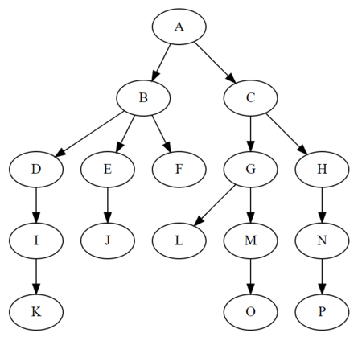

## 9.1 二叉树(**有序二叉树**)

概念:每个节点最多只有2个子节点,分别为左子节点和右子节点

特点:

1. 左子树上的所有节点的值均小于根节点的值
2. 右子书上的所有节点的值均大于根节点的值
3. 任意节点的左,右子树也分别为二叉树
4. 没有键值相等的节点


### 9.1.1 初始化

#### 9.1.1.1 节点

```java
public class Node {
    /**
     * 数据项
     */
    public long data;

    /**
     * 数据项
     */
    public String sDate;

    /**
     * 左节点
     */
    public Node leftChild;
    /**
     * 右节点
     */
    public Node rightChild;

    /**
     * 构造方法
     *
     * @param data
     * @param sDate
     */
    public Node(long data, String sDate) {
        this.data = data;
        this.sDate = sDate;
    }
}
```

#### 9.1.1.2 二叉树

```java
public class OrderedBinaryTree {

    /**
     * 根节点
     */
    private Node root;
}
```

### 9.1.2 基本操作

#### 9.1.2.1 插入节点

```java
public void insert(long value, String sValue) {
    //封装节点
    Node newNode = new Node(value, sValue);
    //引用当前节点
    Node current = root;
    //应用父节点
    Node parent;
    //如果root为null,第一次插入的时候
    if (root == null) {
        root = newNode;
        return;
    } else {    //非第一次插入
        //遍历树
        while (true) {
            //父节点指向当前节点
            parent = current;
            if (current.data > value) {
                //如果当前指向的节点数据比插入的数据大,则走向左子树
                current = current.leftChild;
                if (current == null) {
                    parent.leftChild = newNode;
                    return;
                }
            } else {
                //如果当前指向的节点的数据比插入数据小,则走向右子树
                current = current.rightChild;
                if (current == null) {
                    parent.rightChild = newNode;
                    return;
                }
            }
        }
    }
}
```

#### 9.1.2.2 查找节点

```java
public Node find(long value) {
    //应用当前节点,从根节点开始
    Node current = root;
    //循环,只要查找值不等于当前节点的数据项就一致查找
    while (current.data != value) {
        //进行比较,如果当前节点的值大于查找值,则走向左子树
        if (current.data > value) {
            current = current.leftChild;
        } else {    //如果当前节点的值小于查找值,则走向右子树
            current = current.rightChild;
        }
        //如果查不到,返回null
        if (current == null) {
            return null;
        }
    }
    return current;
}
```

#### 9.1.2.3 遍历节点

* 前序遍历

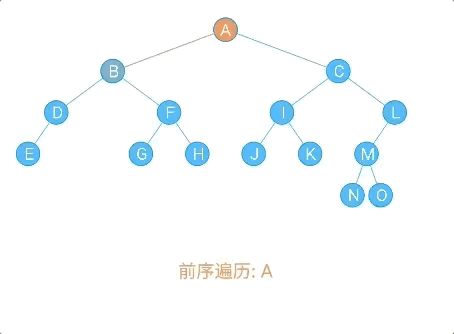

```java
/**
 * 前序遍历:
 * (1)访问根节点
 * (2)先序遍历左子树
 * (3)先序遍历右子树
 *
 * @param localNode
 */
public void frontOrder(Node localNode) {
    if (localNode != null) {
        //访问根节点
        System.out.println(localNode.data + "," + localNode.sData);
        //前序遍历左子树
        frontOrder(localNode.leftChild);
        //前序遍历右子树
        frontOrder(localNode.rightChild);
    }
}
```

* 中序遍历

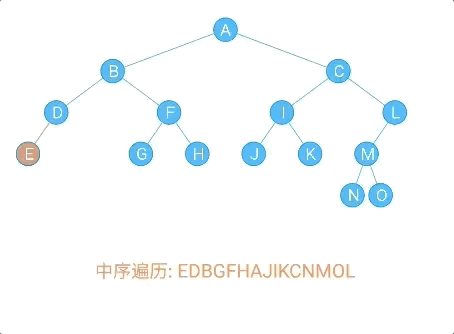

```java
/**
 * 中序遍历
 * (1)中序遍历左子树
 * (2)访问根节点
 * (3)中序遍历右子树
 *
 * @param localNode
 */
public void inOrder(Node localNode) {
    if (localNode != null) {
        //中序遍历左子树
        inOrder(localNode.leftChild);
        //访问根节点
        System.out.println(localNode.data + "," + localNode.sData);
        //中序遍历右子树
        inOrder(localNode.rightChild);
    }
}
```

* 后续遍历

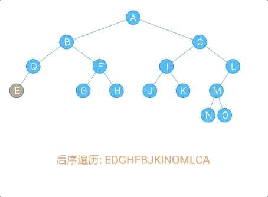

```java
/**
 * 后续遍历
 * (1)后序遍历左子树
 * (2)后序遍历右子树
 * (3)访问根节点
 *
 * @param localNode
 */
public void afterOrder(Node localNode) {
    if (localNode != null) {
        //后续遍历左子树
        afterOrder(localNode.leftChild);
        //后续遍历右子树
        afterOrder(localNode.rightChild);
        //访问根节点
        System.out.println(localNode.data + "," + localNode.sData);
    }
}
```

#### 9.1.2.3 删除节点

* 删除叶子节点:直接删除该节点，再修改其父节点的指针（注意分是根节点和不是根节点）

  eg:删除72

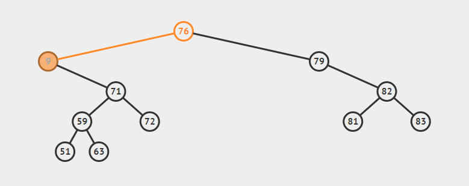

* 删除单支节点:让p的子树与p的父亲节点相连，再删除p即可；（注意分是根节点和不是根节点两种情况）

  eg:删除79

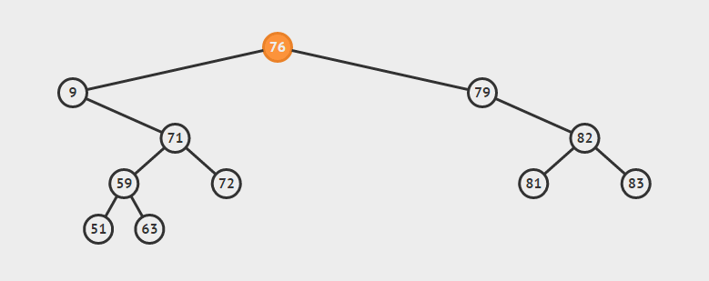

* 删除双支节点:首先找到p的后继y，因为y一定没有左子树，所以可以删除y，并让y的父亲节点成为y的右子树的父亲节点，并用y的值代替p的值

  eg:删除9

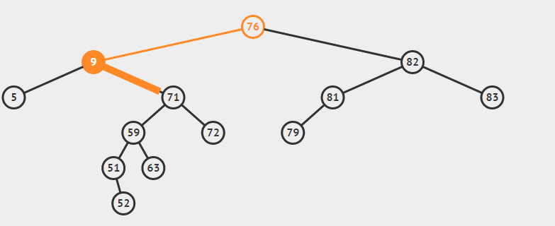

```java
/**
 * 删除节点
 *
 * @param value
 */
public boolean delete(long value) {
    //引用当前节点,从根节点开始
    Node current = root;
    //应用当前节点的父节点
    Node parent = root;
    //当前是否为左节点标记
    boolean isLeftChild = true;
    //查找节点
    while (current.data != value) {
        parent = current;
        if (current.data > value) {
            current = current.leftChild;
        } else {
            current = current.rightChild;
            isLeftChild = false;
        }

        if (current == null) {
            return false;
        }
    }
    //如果是叶子节点
    if (current.leftChild == null && current.rightChild == null) {
        if (current == root) {
            root = null;
        } else if (isLeftChild) {
            parent.leftChild = null;
        } else {
            parent.rightChild = null;
        }
    } else if (current.rightChild == null) {    //单支节点,左节点为空
        if (current == root) {
            root = root.leftChild;
        } else if (isLeftChild) {
            parent.leftChild = current.leftChild;
        } else {
            parent.rightChild = current.rightChild;
        }

    } else if (current.leftChild == null) {     //单支节点,左节点为空
        if (current == root) {
            root = root.rightChild;
        } else if (isLeftChild) {
            parent.leftChild = current.leftChild;
        } else {
            parent.rightChild = current.rightChild;
        }
    } else {  //如果是双支节点
        //1.查找后继节点
        //2.删除后继结点
        //3.让后继结点的父节点称为其右子树的父节点
        //4.让后继节点替代待删除的节点
        Node successor = getSuccessor(current);
        if(current == root) {
            root = successor;
        } else if(isLeftChild) {
            parent.leftChild = successor;
        } else{
            parent.rightChild = successor;
        }
        successor.leftChild = current.leftChild;
    }
    return true;
}

/**
 * 查找后继节点
 *
 * @param delNode
 * @return
 */
private Node getSuccessor(Node delNode) {
    //引用后继节点
    Node successor = delNode;
    //应用后继节点父节点
    Node successorParent = delNode;
    //引用当前节点
    Node current = delNode.rightChild;

    //走向左子树,查找后继节点
    while (current!=null){
        successorParent = successor;
        successor = current;
        current = current.leftChild;
    }

    //判断是否找到
    if(successor!=delNode.rightChild){
        successorParent.leftChild = successor.rightChild;
        successor.rightChild = delNode.rightChild;
    }
    return successor;
}
```

## 9.2 红黑树

如果节点的值有序,那么有序二叉树就会是如下链表形状


如果当值有序依然要建立树形结构的关系,就要使用红黑树,也称自平衡的二叉查找树


插入节点的过程

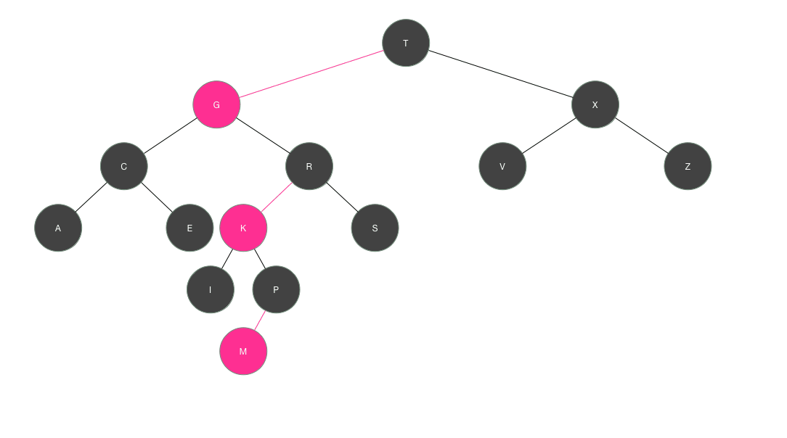

[参考链接](https://luodichen.com/blog/tag/%E7%BA%A2%E9%BB%91%E6%A0%91/)

# 10. Hash

根据键（Key）而直接访问在内存存储位置的[数据结构

## 10.1 初始化

* 实体类

```java
public class Info {
    private String key;
    private String name;
}
```

* Hash表

```java
public class HashTable {

    private Info[] arr;

    public HashTable() {
        arr = new Info[100];
    }

    public HashTable(int maxSize) {
        arr = new Info[maxSize];
    }
}
```

## 10.2 基本操作

### 10.2.1 计算key的Hash值

```java
public int hashCode(String key) {
    /**
     * 这种方式进行转换,如果key='abc' || 'acb' || 'cba'
     * 那么这三个不同的key会计算出相同的hashCode值,造成数据的被覆盖!
     */
	// int hashVal = 0;
	// for (int i = key.length() - 1; i >= 0; i--) {
	//     int letter = key.charAt(i) - 96;
	//     hashVal += letter;
	// }
	// return hashVal;

    BigInteger hashVal = new BigInteger("0");
    BigInteger pow27 = new BigInteger("1");
    for (int i = key.length() - 1; i >= 0; i--) {
        int letter = key.charAt(i) - 96;
        BigInteger letterB = new BigInteger(String.valueOf(letter));
        hashVal = hashVal.add(letterB.multiply(pow27));
        pow27 = pow27.multiply(new BigInteger(String.valueOf(27)));
    }
    return hashVal.mod(new BigInteger((String.valueOf(arr.length)))).intValue();
}
```

### 10.2.2 插入数据

```java
public void insert(Info info) {
    arr[hashCode(info.getKey())] = info;
}
```

### 10.2.3 查找数据

```java
public Info find(String key) {
    return arr[hashCode(key)];
}
```

## 10.3 解决冲突

### 10.3.1 开放地址发

当添加数据发生冲突时,寻找一个空位,并将数据插入.

* 添加元素

```java
public void insert(Info info) {
    //获得关键字的Hash值
    int hashCode = hashCode(info.getKey());
    //如果当前的位置已经占用,并且值不为空
    while (arr[hashCode] != null && arr[hashCode].getName() != null) {
        //进行递加
        ++hashCode;
        //循环
        hashCode %= arr.length;
    }
    arr[hashCode] = info;
}
```

* 查找数据

```java
public Info find(String key) {
    int hashCode = hashCode(key);
    while (arr[hashCode] != null) {
        if (arr[hashCode].getKey().equals(key)) {
            return arr[hashCode];
        }
        ++hashCode;
        hashCode %= arr.length;
    }
    return null;
}
```

* 删除数据

```java
public Info delete(String key) {
    int hashCode = hashCode(key);
    while (arr[hashCode] != null) {
        if (arr[hashCode].getKey().equals(key)) {
            Info info = arr[hashCode];
            info.setName(null);
            return info;
        }
    }
    return null;
}
```

